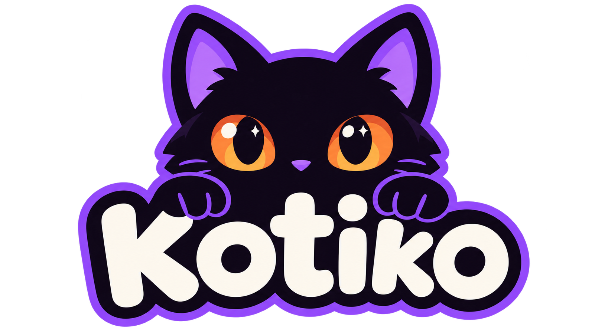
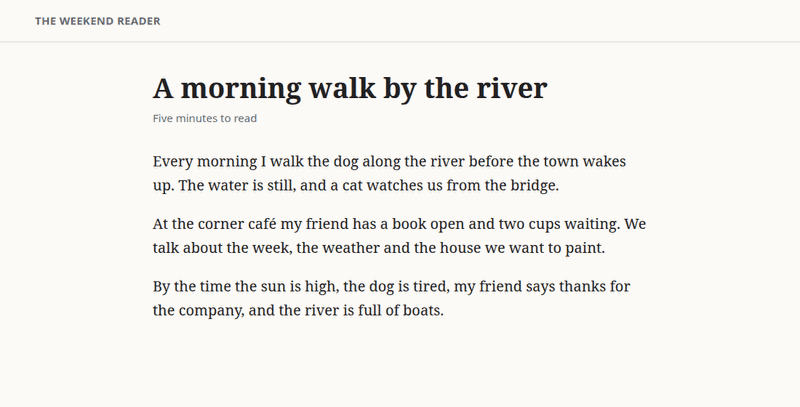

<h1 align="center">
  
</h1>

<!-- legacy-name-ok-start -->
> Formerly Slovo. Updating from it? See [Updating from Slovo](#updating-from-slovo).
<!-- legacy-name-ok-end -->

<p align="center"><strong>Read the web in the words you're learning.</strong></p>

<p align="center">
  <a href="https://github.com/ScriptKittyOS/kotiko/actions/workflows/ci.yml"></a>
  <a href="LICENSE"></a>
</p>

Learn a word in any language, and Kotiko slips it into the pages you already read, in
whatever language you read them. Spanish, Japanese, Russian, Arabic: one at a time, or all
of them mixed. Hover a swapped word to see what it means in your language and how it's
said.

<p align="center">
  
</p>

- **Your words, your languages.** Type a word in any language, in your own words, and
  Kotiko looks it up. Its meaning is kept in the language you read, never assumed to be
  English.
- **Local first.** Your words live in your browser. Lookups use your own AI key (a free
  OpenRouter key works) or a model on your own computer. Nothing else is needed.
- **An optional server.** Run the small Kotiko server yourself to keep your words in one
  place and add them from your phone with your own Telegram bot.
- **Private by design.** Page text never leaves your device; the
  [privacy policy](https://kotiko.org/privacy/) lists everything that does.

<!-- legacy-name-ok-start: Mira is the mascot (slices/05-brand-identity) -->
<p align="center">
  
</p>

**Meet Mira.** Kotiko's mascot is a small black kitten. *Kotiko* bends котик (kotik),
Russian for "kitty", the way a learner bends a word they're still getting to know. And
Mira's name is a clue: in Spanish it means "look", in Latin "wonderful", in Russian
"of the world" and "of peace". Read the [whole story](https://kotiko.org/why/).
<!-- legacy-name-ok-end -->

```
browser extension ──▶ your words in the browser ──▶ your AI key or a local model
        │
        └──(optional)──▶ your Kotiko server (Elixir + SQLite) ◀── your Telegram bot
```

**Guides, help and the privacy policy: [kotiko.org](https://kotiko.org/).**

## Install

- **Chrome, Edge and Brave:** coming soon to the Chrome Web Store.
- **Firefox:** coming soon to Firefox Add-ons.

Until the listings are live, install Kotiko by hand from the
[latest release](https://github.com/ScriptKittyOS/kotiko/releases), or, before the first
release, from this repository's `extension` folder: the
[install guide](https://kotiko.org/install/#from-source) has the steps for each browser.
Then [get started](https://kotiko.org/start/): your first word takes about a minute, with
or without an AI key.

## Run your own server

You don't need one. The optional Kotiko server (Elixir and SQLite) keeps your words in one
place for all your browsers and gives you your own Telegram bot, to add words from your
phone by text or voice. You run it on your own computer; there is no shared server and no
account. [Set it up](https://kotiko.org/server/), or read the
[configuration](docs/reference/configuration.md) and [HTTP API](docs/reference/http-api.md)
references.

<!-- legacy-name-ok-start -->
### Updating from Slovo

Kotiko used to be called Slovo. Stop the old server, `git pull`, and start Kotiko: the first
start moves your words and access key over and leaves the old folder as a backup. The
[step-by-step guide](https://kotiko.org/server/updates/#updating-from-slovo) covers custom
data folders and the service file.
<!-- legacy-name-ok-end -->

## Privacy

The text of the pages you read never leaves your browser. A word you add goes only to the AI
service you chose, or to your own server. Kotiko has no servers of its own and collects
nothing. The [privacy policy](https://kotiko.org/privacy/) (its source is
[docs/privacy/en.md](docs/privacy/en.md)) says exactly what is kept and sent, and
[docs/privacy/inventory.md](docs/privacy/inventory.md) lists every request with the code
that makes it.

## Contributing

Code, translations and ideas are welcome. Start with the
[contributor guide](https://kotiko.org/contribute/) and [CONTRIBUTING.md](CONTRIBUTING.md);
the work is planned in [`slices/`](slices/README.md). To report a security problem, see
[SECURITY.md](SECURITY.md).

## License and trademark

The code is licensed under [Apache-2.0](LICENSE). The name Kotiko, the logo and the
illustrations in `brand/` are trademarks of ScriptKittyOS and aren't covered by that
license; their terms are in [LICENSES/LicenseRef-KotikoBrand.txt](LICENSES/LicenseRef-KotikoBrand.txt).
